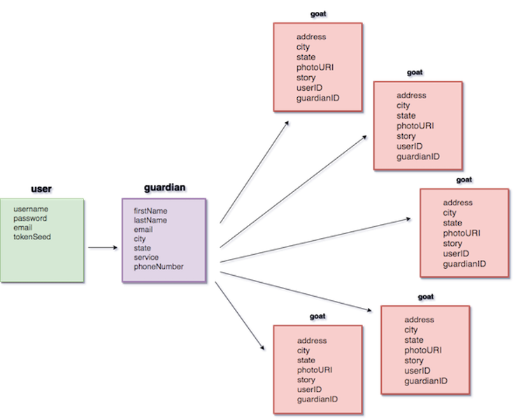

# **Goat Fellows** :goat:
## The RESTful API for people who love goats. 

### Overview

* This RESTful API provides the necessary back-end infrastructure and functionality to create, read, update and destroy data related to a goat rescue website.

* Currently, there is not a site that exists that allows people to become 'Guardians' (people able to provide services that help goats become rescued, get medical attention, and be fostered), and to add 'Goats' that need help of some sort. This site also provides people the ability to see other people who are Guardians in their city/state and see goats that need some kind of help in their city/state.

* There are a lot of websites in existence currently that are tied to one specific goat or animal rescue that provide users the ability to donate and volunteer at that rescue. There is no site that provides users all across the United States to connect with others in their location, and provide services to goats that need help in their location.

* The purpose of our API and supporting infrastructure is to encourage developers to create applications that provide value to the lives of all animals in the United States without advocates or someone to stand for them. It also provides value to the lives of the vast number of people who care about animals and animal welfare.

### The Current Version (0.0.1)

* The current version of this program is designed to create, read, update, and destroy data that is used to add new users, add new guardians, and add new goats.

* This API is designed to be versatile so that anyone can become users, and then become guardians, and then add goats. Before anyone can add a goat they must first become a user and get a tokenSeed. Before anyone can become a guardian, they must first become a user. Before anyone can view guardians and view goats, they must first become a user.

### Future Releases

* V 1.0.0 scheduled to be released 9/25/2017 will include the following:

  * store and return detailed lists of specific people by location who can provide specific services.

  * store and return detailed lists of specific people by location.

  * store and return detailed lists of goats in need by location.

  * store and return detailed lists of goats who have been helped and provided for by specific people by location.

### Contributions

* Reporting bugs:
  * open an issue through this github repository and select 'bug' as the label.

* Recommended enhancements or updates:
  * open an issue through this github repository and select 'enhancement' as the label.

* Issues will be reviewed by a moderator weekly.

### Architecture

* This API is structured in a RESTful architecture pattern. The frameworks we used were express.js (middleware, node.js web application framework), node.js (JS runtime built on Chromes V8 JS engine), and mongodb(open source document database for querying and indexing).

### Middleware

* The express router middleware provides us with a base routing capability.

  * The handle-errors module implements and extends the http-errors npm middleware package.

  * An auth middleware module leverages two npm modules (jsonwebtoken, bcrypt) and the node.crypto module to provide user sign-up and user login functionality in addition to session authorization and authentication(using basic auth and bearer auth).

  * The mongoose npm module (that has the worlds worst docs) is used to interact with the mongo database.

### Lib

* This directory holds all of our middleware files that we created as well as our server, including:

  * basic auth middleware(authorization)

  * bearer auth middleware(authentication)

  * error middleware(basic)

  * s3 upload middleware(streaming multer storage engine for AWS s3)

### Model

* This directory holds our three models:

  * **Goat** - contains a mongoose model Schema with properties related to our goat.

  * **Guardian** - contains a mongoose model Schema with properties related to our guardian.

  * **User** - contains a mongoose model Schema with properties required for a user.

    * The user Schema has methods attached to it for creating a user, creating a token, creating a tokenSeed, hashing a password, and password hash compare.

### MVP Schema Diagram

{:class="img-responsive"}{:height="480px" width="588px"}

## **Routes**

### POST /api/signup
&nbsp;

* This POST route requires the user to provide a username, password, and email, and basic auth gives them a tokenSeed.

  * This route will create a new user by providing a username, password, and email address in the body of the request.

  * Creating a new user is required to store and access data later.
  * This request must be completed before attempting to use the api/signup route.

`{"username":"izzybaer", "password":"iLovegoats!2115", "email":"izabellabaer@gmail.com"}`

* A token will be returned that will only be used for the api/login route.

  * After signing in you will receive a new token that will be a reference for all future routes.

### POST /api/goats
&nbsp;

* This POST route is a route that can be created by a guardian and it requires them to provide a city, state, address, photo, and a description of the goat and situation.

  * This route will create and return a new goat by providing all of the required properties of the goat model.

  * Once a users guardianID and userID are authenticated with Bearer auth they will be allowed to create a new goat.

### POST /api/guardians
&nbsp;

* This POST route is a route that can be created once a user has been created, or a user has signed up and received a tokenSeed.

  * This route will create and return a new guardian body by providing all of the required properties of the guardian model.

  * Once a users userID and tokenSeed is authenticated with Bearer auth they will be allowed to create themselves as a new guardian.

### GET /api/login
&nbsp;

* This GET route requires an Authorization header, and the user to provide a username and password.

  * The Authorization header needs to include the username:password of the specific user to be authenticated.

  * Logging in will return a brand new token that will be used for future user ID reference.

### GET /api/goats/:id
&nbsp;

* This GET route requires a userID and a guardianID.

  * This route will return a view of a goat posting on the site, with all of the properties the goat model requires.

  * Once a users token is verified by Bearer auth they will be allowed to view a goat.

### GET /api/guardians/:id
&nbsp;

* This GET route requires a guardianID.

  * This route will return a view of a new guardian body with all of the properties that the guardian model requires.

  * Once a users token is verified by Bearer auth they will be allowed to view themselves and others as guardians.

### PUT /api/goats/:id
&nbsp;

* This PUT route requires a guardianID in order to update a goat.

  * This route will return an updated goat posting with the required properties of the goat model.

  * The user must be authenticated by Bearer auth in order to update a goat, and in order to be authenticated they need a guardianID.

  * Once a user has been authenticated by Bearer auth, they will be allowed to update an existing goat post.

### PUT /api/guardians/:id
&nbsp;

* This PUT route requires a token in order to update a guardian.

  * This route will return an updated guardian profile with all of the properties of the guardian model.

  * The user must be authenticated by Bearer auth in order to update their own 'guardian', in order to be authenticated they must provide the token that they received when they became a user and 'signed up'.

  * Once a user has been authenticated by Bearer auth they will be allowed to update their guardian profile.

### DELETE /api/goats/:id
&nbsp;

* This PUT route requires a guardianID in order to delete a goat from the site.

  * This route will return a view that the goat has been successfully deleted from the database and website.

  * The user must be authenticated by Bearer auth in order to delete a goat, and in order to be authenticated they need a guardianID.

  * Once a user has been authenticated by Bearer auth they will be allowed to delete a goat.

### DELETE /api/guardians/:id
&nbsp;

* This DELETE route requires a token in order to delete a guardian.

  * This route will return a view that their guardian profile with all of the required guardian properties of the guardian model has been successfully deleted.

  * The user must be authenticated Bearer auth in order to delete their own 'guardian', and in order to be authenticated by Bearer auth they must provide the token that they received when they became a user and 'signed up'.

  * Once a user has been authenticated by Bearer auth they will be allowed to delete their guardian profile.

# **Meet The Team**
&nbsp;

{:class="img-responsive"}{:height="px" width="px"}

{:class="img-responsive"}{:height="px" width="px"}

{:class="img-responsive"}{:height="px" width="px"}

{:class="img-responsive"}{:height="px" width="px"}
